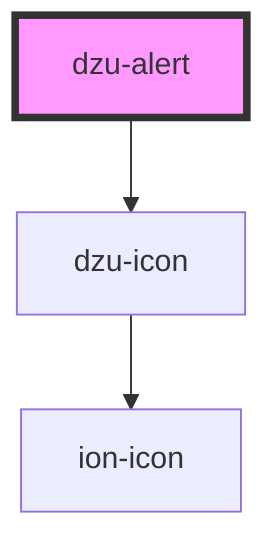

# dzu-alert

<!-- Auto Generated Below -->

## Properties

| Property      | Attribute      | Description                                                    | Type                                         | Default     |
| ------------- | -------------- | -------------------------------------------------------------- | -------------------------------------------- | ----------- |
| `class`       | `class`        |                                                                | `string`                                     | `undefined` |
| `isCloseable` | `is-closeable` |                                                                | `boolean`                                    | `undefined` |
| `level`       | `level`        | Severity of the alert                                          | `Level.error \| Level.info \| Level.warning` | `undefined` |
| `size`        | `size`         |                                                                | `string`                                     | `undefined` |
| `src`         | `src`          | src for an icon, otherwise one is choosen arording to severity | `string`                                     | `undefined` |

## Events

| Event    | Description | Type                    |
| -------- | ----------- | ----------------------- |
| `closed` |             | `CustomEvent<DzuAlert>` |

## Dependencies

### Depends on

- [dzu-icon](../dzu-icon)

### Graph

----------------------------------------------

*Built with [StencilJS](https://stenciljs.com/)*
