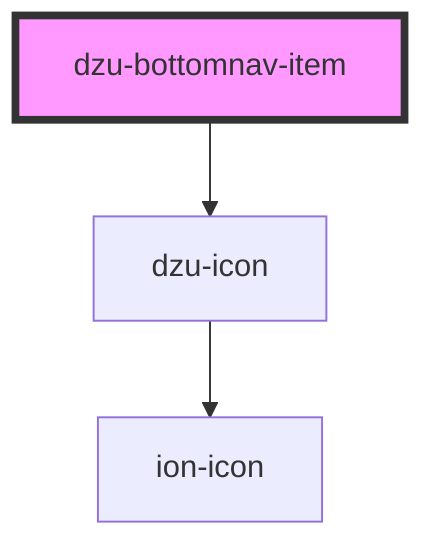

# dzu-bottomnav

<!-- Auto Generated Below -->

## Properties

| Property | Attribute | Description | Type      | Default     |
| -------- | --------- | ----------- | --------- | ----------- |
| `active` | `active`  |             | `boolean` | `undefined` |
| `class`  | `class`   |             | `string`  | `undefined` |
| `href`   | `href`    |             | `string`  | `undefined` |
| `icon`   | `icon`    |             | `string`  | `undefined` |
| `src`    | `src`     |             | `string`  | `undefined` |

## Dependencies

### Depends on

- [dzu-icon](../dzu-icon)

### Graph

----------------------------------------------

*Built with [StencilJS](https://stenciljs.com/)*
