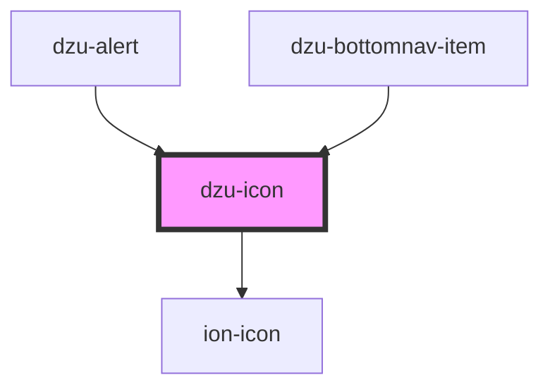

# dzu-icon

<!-- Auto Generated Below -->

## Properties

| Property | Attribute | Description                                                    | Type     | Default     |
| -------- | --------- | -------------------------------------------------------------- | -------- | ----------- |
| `color`  | `color`   | src for an icon, otherwise one is choosen arording to severity | `string` | `undefined` |
| `name`   | `name`    |                                                                | `string` | `undefined` |
| `size`   | `size`    |                                                                | `number` | `22`        |

## Dependencies

### Used by

 - [dzu-alert](../dzu-alert)
 - [dzu-bottomnav-item](../dzu-bottomnav)

### Depends on

- ion-icon

### Graph

----------------------------------------------

*Built with [StencilJS](https://stenciljs.com/)*
